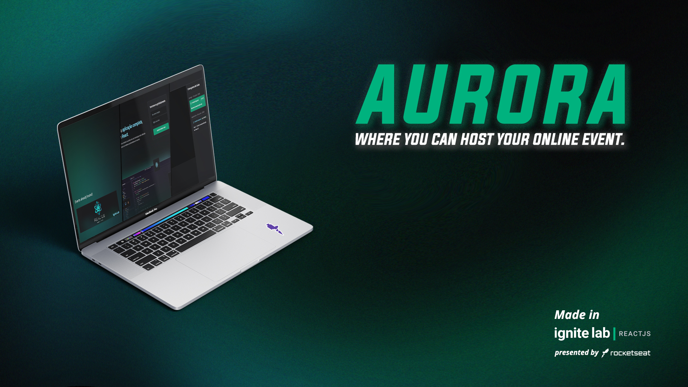

<h1 align="center">
<span style="color: #00B37E; font-size: 50px">Aurora</span> is an event video plataform.
</h1>



<div align="center">
	
	
	
</div>

***

<p align="center">
  <a href="#about">About</a> &#xa0; | &#xa0;
  <a href="#tech-used">Tech Used</a> &#xa0; | &#xa0;
  <a href="#layout">Layout</a> &#xa0; | &#xa0;
  <a href="#functionalities">Functionalities</a> &#xa0; | &#xa0;
  <a href="#roadMap">Road Map</a> &#xa0; | &#xa0;
  <a href="#howToStartTheProject">Run Project</a> &#xa0; | &#xa0;
  <a href="#license">License</a> &#xa0; | &#xa0;
  <a href="https://ignite-lab.rocketseat.com.br/ticket/green/Franciscoborges2002/share">My ticket of the event</a> &#xa0; | &#xa0;
  <a href="https://github.com/Franciscoborges2002" target="_blank">Author</a>
</p>

## About <a name="about"></a>
I made this project in the event of [RocketSeat](https://www.rocketseat.com.br/) called Ignite Lab that is being presented by [Diego Fernandes](https://github.com/diego3g).
But i wanted something more with the project so i renamed Aurora and started making some adjustments.
So this is my version of the main project of Ignite Lab, hope you like it :)

## 🧰 Tech used <a name="tech-used"></a>
1. [React](reactjs.org)
2. [Typescript](https://www.typescriptlang.org/)
3. [Vite](https://vitejs.dev/)
3. [Tailwind](https://tailwindcss.com/)
4. Headless CMS with [graphcms](https://graphcms.com/)
5. [@apollo/client](https://www.apollographql.com/) and [Graphql](https://graphql.org/)
6. [Phosphor](https://phosphoricons.com/) icon family

## 🔖 Layout <a name="layout"></a>
You can see the layout thourh [Figma](https://www.figma.com/community/file/1120711251998877938). You need to have an account to access.

## ⚙️ Functionalities <a name="functionalities"></a>
✔️ Mockup of a main page for Aurora.
✔️ Main page for Ignite lab event.
✔️ Participants for events.
✔️ Loading page, while getting info.
✔️ PP page, just a simple page.

## 🛣️ Road Map <a name="roadMap"></a>
- [x] All Lessons 5/5
- [ ] Extra Mile
    - [x] Placeholder when no video is clicked
    - [ ] Main page to Aurora
    - [x] Políticas de Privacidade Page protopype
    - [x] Loading Page
    - [x] Participants Page
- [ ] Custom Video Player
- [ ] Make App Responsive

### Start the project <a name="howToStartTheProject"></a>
Before starting the project you need at least [Git](https://git-scm.com) and [Node](https://nodejs.org).

```bash
	#First, let's clone the project
	$git clone https://github.com/Franciscoborges2002/Aurora

	#In second place, let's acess the cloned git
	$cd Aurora

	#In the next step we need to intall all the dependencies:
	$npm install
	#OR
	$yarn
	
	#Last step, lets run the project:
	$npm run dev
	#OR
	$yarn dev
```

## 📝[License](https://github.com/Franciscoborges2002/Aurora/blob/main/LICENSE) <a name="license"></a>

Made with 💚 by [Francisco Borges](https://github.com/Franciscoborges2002)  